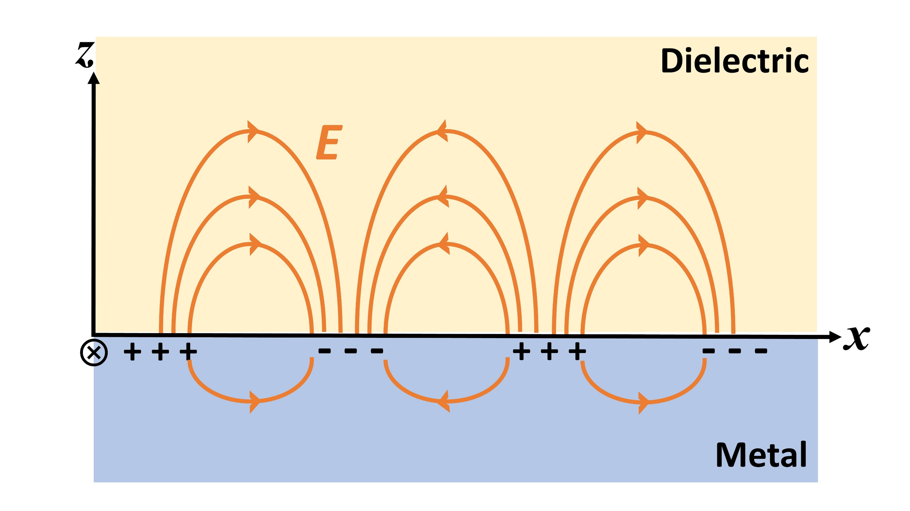

# Surface plasmon polariton

Поверхностные плазмон-поляритоны (ППП, SPP) - это электромагнитные волны, распространяющиеся в приграничном слое на стыке металла и диэлектрика (хотя, вообще говоря, достаточно и простого контраста диэлектрических проницаемостей, при котором $\epsilon_1 \epsilon_2<0$). Их возникновение обусловлено взаимодействием ЭМ-поля в диэлектрике с электронной плазмой металла. Простейшей системой, в которой может возникнуть поверхностный плазмонполяритон, как раз является плоская граница раздела диэлектрика ($z > 0$, $\epsilon= \epsilon_2$) и металла ($z <0$, $\epsilon= \epsilon_1(\omega)$).

Слои параллельны плоскости $x-y$. "Вверх" определяется как направление увеличения $z$. Мы рассчитываем поверхностные плазмон-поляритоны (SPP), распространяющиеся вдоль оси $x$, и однородные в направлении $y$ ($k_y = 0$). Общее количество слоёв — $N$, они нумеруются от $0$ до $N-1$, где слои $0$ и $N-1$ имеют бесконечную толщину. Слой $0$ находится внизу ($z \ll 0$), а слой $N-1$ — сверху ($z \gg 0$).

Слой $m$ имеет (AC) диэлектрическую проницаемость $\varepsilon_{xm}$ в направлении $x$ и $\varepsilon_{zm}$ в направлении $z$, а также магнитную проницаемость $\mu_{ym}$. Хотя мы не предполагаем изотропность диэлектрической или магнитной проницаемости, мы предполагаем, что недиагональные элементы, такие как $\varepsilon_{xz}$, равны нулю.

Весь текст представлен в системе СИ. Диэлектрическая и магнитная проницаемости безразмерны (по сравнению с $\varepsilon_0$ или $\mu_0$), за исключением самих $\varepsilon_0$ и $\mu_0$.

$k_x$ — комплексное волновое число в плоскости. Мы заранее не знаем его значение; его нужно определить.

**TM поляризация**
$$
\mathbf{E}(x,z,t) = \mathbf{E}(z) e^{i(k_x x - \omega t)}, \quad \mathbf{H}(x,z,t) = \mathbf{H}(z) e^{i(k_x x - \omega t)}
$$

Из уравнений Максвелла (в частных производных):

1. $ \nabla \times \mathbf{E} = -\frac{\partial \mathbf{B}}{\partial t} $
2. $ \nabla \times \mathbf{H} = \frac{\partial \mathbf{D}}{\partial t} $

Для TM-моды, используя эти уравнения, можно получить:

$$
E_x = -\frac{i}{\omega \varepsilon_0 \varepsilon_{xm}} \frac{\partial H_y}{\partial z}, \quad
E_z = \frac{i k_x}{\omega \varepsilon_0 \varepsilon_{zm}} H_y
$$

Подставим выражения выше в волновое уравнение:

$$
\nabla^2 H_y = \mu_0 \mu_{ym} \varepsilon_0 \varepsilon_{xm} \frac{\partial^2 H_y}{\partial t^2}
$$

С учетом гармонической зависимости от времени и пространства:

$$
(-k_x^2 + k_z^2) H_y = -\mu_0 \mu_{ym} \varepsilon_0 \varepsilon_{xm} \omega^2 H_y
$$

Упрощаем:
$$
k_z^2 = \mu_0 \mu_{ym} \varepsilon_0 \varepsilon_{xm} \omega^2 + k_x^2
$$

$$
\nabla \cdot \mathbf{D} = 0 \Rightarrow \frac{\partial}{\partial x} (\varepsilon_{xm} E_x) + \frac{\partial}{\partial z} (\varepsilon_{zm} E_z) = 0
$$

Подставляем выражения для $ E_x $ и $ E_z $ через $ H_y $:

$$
k_{zm} = \pm \sqrt{\omega^2 \mu_{ym} \varepsilon_{xm} / c^2 - (\varepsilon_{xm} / \varepsilon_{zm}) k_x^2}
$$
(выбираем корень с неотрицательной мнимой частью)

> Если $k_{zm}$ вещественное, то можно выбрать любой знак, это не имеет значения. Единственное место, где это может быть важно — полубесконечные слои, но в этом случае $k_{zm}$ никогда не будет вещественным, иначе волна не будет локализована.

Когда мы записываем формулу для $\vec{E}(z)$ или $\vec{H}(z)$, подразумевается, что её нужно умножить на $e^{i k_x x - i \omega t}$ и взять действительную часть.

Обсуждение основано главным образом на $H$-поле, поскольку оно скалярное (направлено по оси $y$), в отличие от электрического поля, которое имеет две компоненты. Иногда могут использоваться обозначение $H(z)$ вместо $H_y(z)$. Для слоя $m$:

$$
H_y(z) = H_{m\uparrow} e^{i k_{zm} (z-z_{\text{низ слоя } m})} + H_{m\downarrow} e^{i k_{zm} (z_{\text{верх слоя } m} - z)}
$$

$$
E_x(z) = E_{xm\uparrow} e^{i k_{zm} (z-z_{\text{низ слоя } m})} + E_{xm\downarrow} e^{i k_{zm} (z_{\text{верх слоя } m} - z)}
$$

$$
E_z(z) = E_{zm\uparrow} e^{i k_{zm} (z-z_{\text{низ слоя } m})} + E_{zm\downarrow} e^{i k_{zm} (z_{\text{верх слоя } m} - z)}
$$

где

$$
E_{xm\uparrow} = \frac{H_{m\uparrow} k_{zm}}{\omega \varepsilon_{xm} \varepsilon_0}, \quad
E_{xm\downarrow} = -\frac{H_{m\downarrow} k_{zm}}{\omega \varepsilon_{xm} \varepsilon_0}
$$

$$
E_{zm\uparrow} = -\frac{H_{m\uparrow} k_x}{\omega \varepsilon_{zm} \varepsilon_0}, \quad
E_{zm\downarrow} = -\frac{H_{m\downarrow} k_x}{\omega \varepsilon_{zm} \varepsilon_0}
$$

(при этом $X_{m\uparrow}=0$ в слое $0$ (нет нижней границы) и $X_{m\downarrow}=0$ в слое $N-1$ (нет верхней границы)). $X_{m\uparrow}$ описывает компоненту, затухающую при увеличении $z$, а $X_{m\downarrow}$ — при уменьшении $z$.

Проверим, что полученные выше уравнения не нарушают уравнения Максвелла
$$
-i\omega (\mu_y \mu_0 H) = \partial_t B \stackrel{?}{=} -\nabla \times E \;\; \rightarrow \;\; H \stackrel{?}{=} (-i/\mu_0\mu_y\omega)\nabla \times E
$$

$$
H_y \stackrel{?}{=} \frac{-i}{\mu_0 \mu_{ym} \omega} \left(\partial_z E_x - \partial_x E_z\right)
= \frac{H_{m\uparrow} e^{i k_{zm} (z-z_{\text{низ слоя } m})}}{\mu_0 \mu_{ym} \omega^2 \varepsilon_0} \left(\frac{k_{zm}^2}{\varepsilon_{xm}} + \frac{k_x^2}{\varepsilon_{zm}}\right) + \frac{H_{m\downarrow} e^{i k_{zm} (z_{\text{верх слоя } m} - z)}}{\mu_0 \mu_{ym} \omega^2 \varepsilon_0} \left(\frac{k_{zm}^2}{\varepsilon_{xm}} + \frac{k_x^2}{\varepsilon_{zm}}\right)
$$

✅ Работает!

$$
\nabla \times H \stackrel{?}{=} -i \omega (\varepsilon \varepsilon_0) E \;\; \rightarrow \;\; E \stackrel{?}{=} \frac{i}{\omega \varepsilon \varepsilon_0} \nabla \times H
$$

$$
E_z \stackrel{?}{=} \frac{i}{\omega \varepsilon_{zm} \varepsilon_0} \partial_x H_y
= \frac{i}{\omega \varepsilon_{zm} \varepsilon_0} \left( i k_x H_{m\uparrow} e^{i k_{zm} (z-z_{\text{низ слоя } m})} + i k_x H_{m\downarrow} e^{i k_{zm} (z_{\text{верх слоя } m} - z)}\right)
$$

$$
E_x \stackrel{?}{=} \frac{-i}{\omega \varepsilon_{xm} \varepsilon_0} \partial_z H_y
= \frac{-i}{\omega \varepsilon_{xm} \varepsilon_0} \left( i k_{zm} H_{m\uparrow} e^{i k_{zm} (z-z_{\text{низ слоя } m})} - i k_{zm} H_{m\downarrow} e^{i k_{zm} (z_{\text{верх слоя } m} - z)}\right)
$$

✅ Работает!

$$
\nabla \cdot \vec{D} \stackrel{?}{=} 0 \;\; \rightarrow \;\; \varepsilon_x \partial_x E_x + \varepsilon_z \partial_z E_z \stackrel{?}{=} 0
$$

$$
0 \stackrel{?}{=} \left( i \varepsilon_{xm} k_x E_{xm\uparrow} e^{i k_{zm} (z-z_{\text{низ слоя } m})} + i \varepsilon_{xm} k_x E_{xm\downarrow} e^{i k_{zm} (z_{\text{верх слоя } m} - z)} \right) + \left( i \varepsilon_{zm} k_{zm} E_{zm\uparrow} e^{i k_{zm} (z-z_{\text{низ слоя } m})} - i \varepsilon_{zm} k_{zm} E_{zm\downarrow} e^{i k_{zm} (z_{\text{верх слоя } m} - z)} \right)
$$

✅ Работает!

## Стратегия решения

Угадываем $k_x$. Затем вычисляем все $k_{zm}$. У нас есть $2N-2$ неизвестных (все $H_{m\uparrow}, H_{m\downarrow}$, кроме $H_{0\downarrow}$ и $H_{N-1,\uparrow}$) и $(N-1)$ границ, каждая из которых даёт два уравнения непрерывности ($E_x$ непрерывно и $\varepsilon_z E_z$ непрерывно). Предполагаем, что $H_y$ тоже непрерывно, но это избыточно по сравнению с другими двумя. Таким образом, это система линейных уравнений с нетривиальным решением. Существует связанная матрица, определитель которой должен быть равен нулю. Мы можем вычислить этот определитель для каждого возможного $k_x$ и использовать его как меру качества для поиска реального решения.

**Непрерывность $E_x$:**

$$
E_{x0\downarrow} = E_{x1\uparrow} + E_{x1\downarrow} e^{i k_{z1} d_1}
$$

$$
E_{x1\uparrow} e^{i k_{z1} d_1} + E_{x1\downarrow} = E_{x2\uparrow} + E_{x2\downarrow} e^{i k_{z2} d_2}
$$

$$
\cdots
$$

$$
E_{x(N-2)\uparrow} e^{i k_{z(N-2)} d_{(N-2)}} + E_{x(N-2)\downarrow} = E_{x(N-1)\uparrow}
$$

**Непрерывность $\varepsilon_z E_z$:**

$$
\varepsilon_{z0} E_{z0\downarrow} = \varepsilon_{z1} E_{z1\uparrow} + \varepsilon_{z1} E_{z1\downarrow} e^{i k_{z1} d_1}
$$

$$
\varepsilon_{z1} E_{z1\uparrow} e^{i k_{z1} d_1} + \varepsilon_{z1} E_{z1\downarrow} = \varepsilon_{z2} E_{z2\uparrow} + \varepsilon_{z2} E_{z2\downarrow} e^{i k_{z2} d_2}
$$

$$
\cdots
$$

$$
\varepsilon_{z(N-1)} E_{z(N-2)\uparrow} e^{i k_{z(N-2)} d_{(N-2)}} + \varepsilon_{z(N-2)} E_{z(N-2)\downarrow} = \varepsilon_{z(N-1)} E_{z(N-1)\uparrow}
$$

Запишем это в виде матрицы, это так называемый [Transfer Matrix Method](https://en.wikipedia.org/wiki/Transfer-matrix_method_(optics)). Он используется для система с паралельными разделами слоев. В нем переход между слоями определяется матрциами:

\[
\left( \begin{array}{c}
E(z+L) \\ 
H(z+L)
\end{array} \right) 
= M \cdot 
\left( \begin{array}{c}
E(z) \\ 
H(z)
\end{array} \right)
\]

Для системы из $N$ слоев матрица перехроды будет иметь вид:

$$
M = M_1 \cdot M_2 \cdot ... \cdot M_N
$$

Рассмотрим пример для 4 слоев, для из которых уходят на бесконечность. Для краткости, пусть $\delta_m = e^{i k_{zm} d_m}$. Тогда матрица системы:

$$
\begin{pmatrix}
\frac{E_{x0\downarrow}}{H_{0\downarrow}} & -\frac{E_{x1\uparrow}}{H_{1\uparrow}} & -\frac{E_{x1\downarrow}}{H_{1\downarrow}} \delta_1 & 0 & 0 & 0 \\
0 & \frac{E_{x1\uparrow}}{H_{1\uparrow}} \delta_1 & \frac{E_{x1\downarrow}}{H_{1\downarrow}} & -\frac{E_{x2\uparrow}}{H_{2\uparrow}} & -\frac{E_{x2\downarrow}}{H_{2\downarrow}} \delta_2 & 0 \\
0 & 0 & 0 & \frac{E_{x2\uparrow}}{H_{2\uparrow}} \delta_2 & \frac{E_{x2\downarrow}}{H_{2\downarrow}} & -\frac{E_{x3\uparrow}}{H_{3\uparrow}} \\ \hline
\varepsilon_{z0}\frac{E_{z0\downarrow}}{H_{0\downarrow}} & -\varepsilon_{z1}\frac{E_{z1\uparrow}}{H_{1\uparrow}} & -\varepsilon_{z1}\frac{E_{z1\downarrow}}{H_{1\downarrow}} \delta_1 & 0 & 0 & 0 \\
0 & \varepsilon_{z1} \frac{E_{z1\uparrow}}{H_{1\uparrow}} \delta_1 & \varepsilon_{z1} \frac{E_{z1\downarrow}}{H_{1\downarrow}} & -\varepsilon_{z2} \frac{E_{z2\uparrow}}{H_{2\uparrow}} & -\varepsilon_{z2} \frac{E_{z2\downarrow}}{H_{2\downarrow}} \delta_2 & 0 \\
0 & 0 & 0 & \varepsilon_{z2} \frac{E_{z2\uparrow}}{H_{2\uparrow}} \delta_2 & \varepsilon_{z2} \frac{E_{z2\downarrow}}{H_{2\downarrow}} & -\varepsilon_{z3} \frac{E_{z3\uparrow}}{H_{3\uparrow}}
\end{pmatrix}
\begin{pmatrix} H_{0\downarrow} \\ H_{1\uparrow} \\ H_{1\downarrow} \\ H_{2\uparrow} \\ H_{2\downarrow} \\ H_{3\uparrow} \end{pmatrix} = \begin{pmatrix} 0 \\ 0 \\ 0 \\ 0 \\ 0 \\ 0 \end{pmatrix}
$$

(Горизонтальная линия разделяет уравнения для $E_x$ и $E_z$.)

Чтобы система имела нетривиальное решение, необходимо выполнение условия:
$$
det(M(k_x))=0
$$
Таким образом, задача сводится к поиску комплексного $k_x$, обращающего определитель матрицы $M(k_x)$ в ноль.

**Численный поиск корня**
- Создаётся сетка по $Re(k_x)$ и $Im(k_x)$
- На этой сетке рассчитывается значение $∣det(M)∣$
- Ищем на сетке минимум детерминанта
- Сужаем область поиска для всех минимумов

**Вектор Пойнтинга**
$$
\mathbf{S}(z, t) = \mathbf{E}(z, t) \times \mathbf{H}(z, t)
$$

Поля представлены в виде:

$$
E_x(z,t) = \text{Re}\left[ E_x(z) e^{i k_x x - i \omega t} \right] \\
H_y(z,t) = \text{Re}\left[ H_y(z) e^{i k_x x - i \omega t} \right]
$$

Тогда:

$$
S_x(z,t) = E_z(z,t) \cdot H_y(z,t)
= \text{Re}\left[ E_z(z) e^{-i\omega t} \right] \cdot \text{Re}\left[ H_y(z) e^{-i\omega t} \right]
$$

Раскрываем:

$$
\text{Re}(A e^{-i\omega t}) = \frac{1}{2}(A e^{-i\omega t} + A^* e^{i\omega t})
$$

Подставляем:

$$
S_x(z,t) = \frac{1}{4} (E_z e^{-i\omega t} + E_z^* e^{i\omega t})(H_y e^{-i\omega t} + H_y^* e^{i\omega t})
$$

Раскрываем скобки:

$$
S_x(z,t) = \frac{1}{4} \Big(
E_z H_y e^{-2i\omega t} +
E_z H_y^* +
E_z^* H_y +
E_z^* H_y^* e^{2i\omega t}
\Big)
$$

Теперь усредняем по времени:

$$
\langle S_x(z) \rangle = \frac{1}{T} \int_0^T S_x(z,t) dt
$$

Члены $ e^{\pm 2i\omega t} $ исчезают при усреднении (их интеграл за период равен нулю). Остаются только средние значения от членов без временной зависимости:

$$
\langle S_x(z) \rangle = \frac{1}{4} (E_z H_y^* + E_z^* H_y)
= \frac{1}{2} \cdot \frac{1}{2} (E_z H_y^* + E_z^* H_y)
= \frac{1}{2} \cdot \text{Re}(E_z H_y^*)
$$

Подставляем наши поля:

$$
S_x = -(1/2)E_z H_y^*= -\frac{1}{2} (E_{zm\uparrow}e^{ik_{zm}(z-z_\text{низ слоя m})} + E_{zm\downarrow}e^{ik_{zm}(z_\text{верх слоя m} - z)}) (H^*_{zm\uparrow}e^{ik^*_{zm}(z_\text{верх слоя m}-z)} + H^*_{zm\downarrow}e^{ik^*_{zm}(z - z_\text{низ слоя m})}) = 
$$

$$
= \frac{-E_{zm\uparrow}H_{m\uparrow}^*}{2}e^{-2 Im(k_{zm})(z-z_{\text{низ слоя } m})} + \frac{-E_{zm\downarrow}H_{m\downarrow}^*}{2}e^{-2 Im(k_{zm})(z_{\text{верх слоя } m}-z)} + \frac{-E_{zm\downarrow}H_{m\uparrow}^*}{2} e^{ik_{zm} d_m}e^{-2i Re(k_{zm})(z-z_{\text{низ слоя } m})} + \frac{-E_{zm\uparrow}H_{m\downarrow}^*}{2} e^{ik_{zm} d_m}e^{-2i Re(k_{zm})(z_{\text{верх слоя } m}-z)}
$$

Проинтегрируем:
$$
\int_{z_{\text{низ слоя } m}}^{z_{\text{верх слоя } m}} S_x = \frac{-E_{zm\uparrow}H_{m\uparrow}^*}{4 Im(k_{zm})}(1-e^{-2Im(k_{zm})d_m}) + \frac{-E_{zm\downarrow}H_{m\downarrow}^*}{4 Im(k_{zm})}(1-e^{-2Im(k_{zm})d_m}) + \frac{-E_{zm\downarrow}H_{m\uparrow}^*}{4iRe(k_{zm})} e^{i k_{zm} d_m} (1 - e^{-2iRe(k_{zm})d_m}) + \frac{-E_{zm\uparrow}H_{m\downarrow}^*}{4i Re(k_{zm})} e^{ik_{zm} d_m}(1 - e^{-2i Re(k_{zm})d_m})
$$

